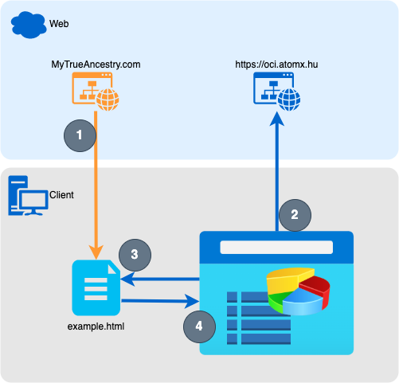
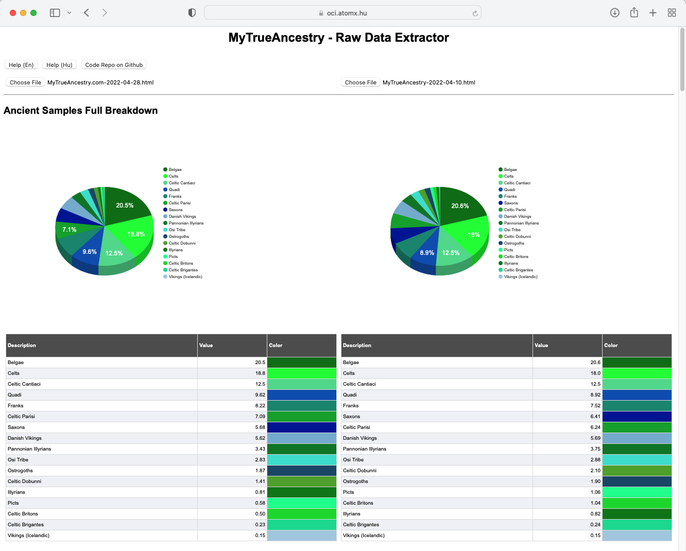
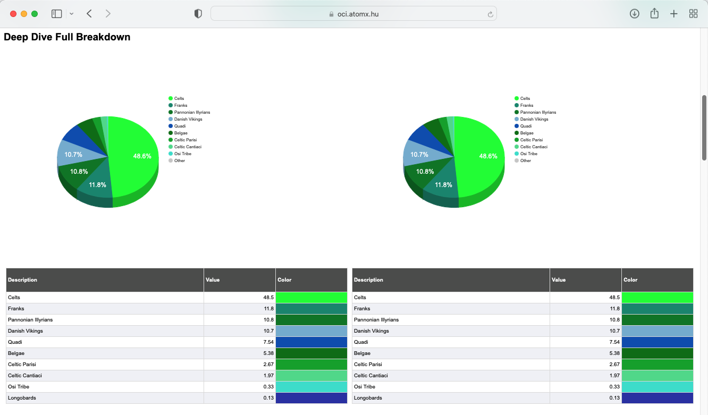
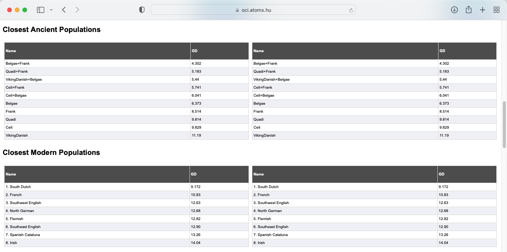
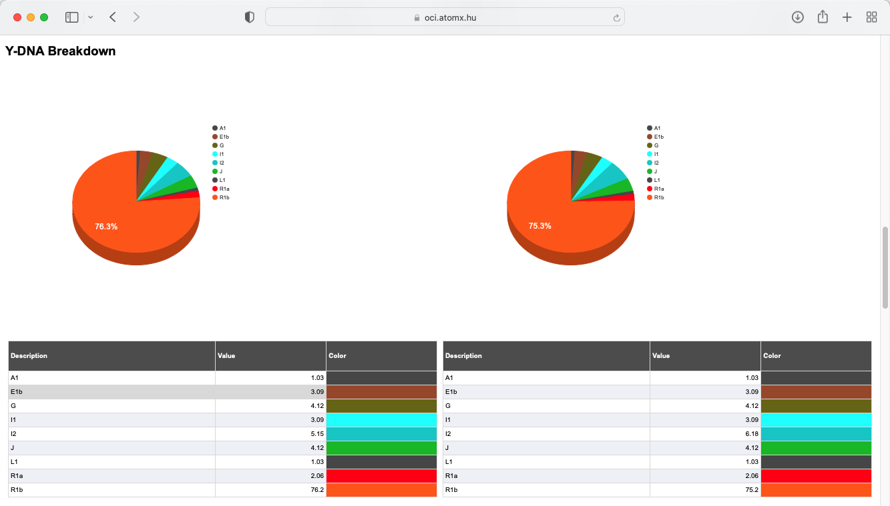
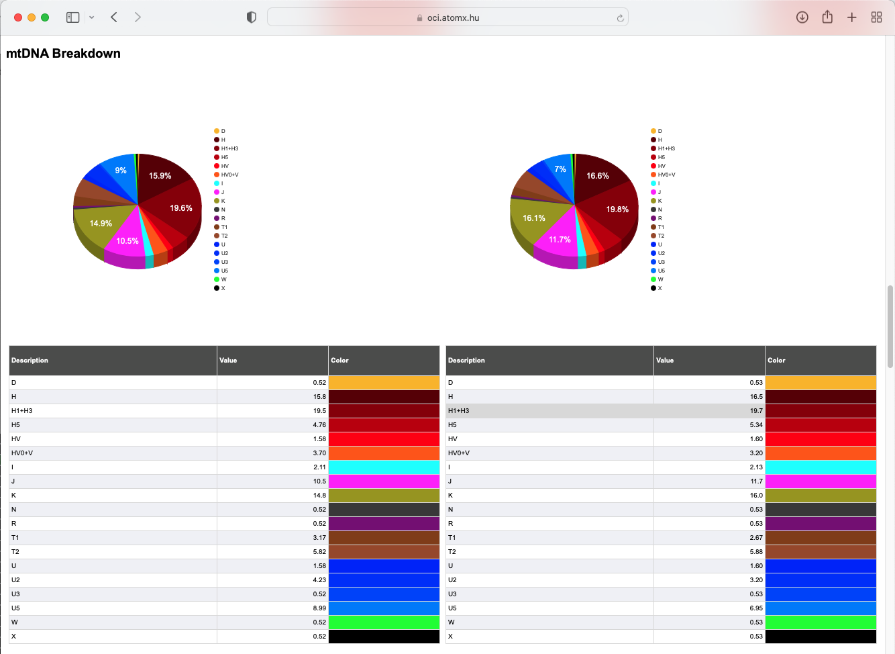
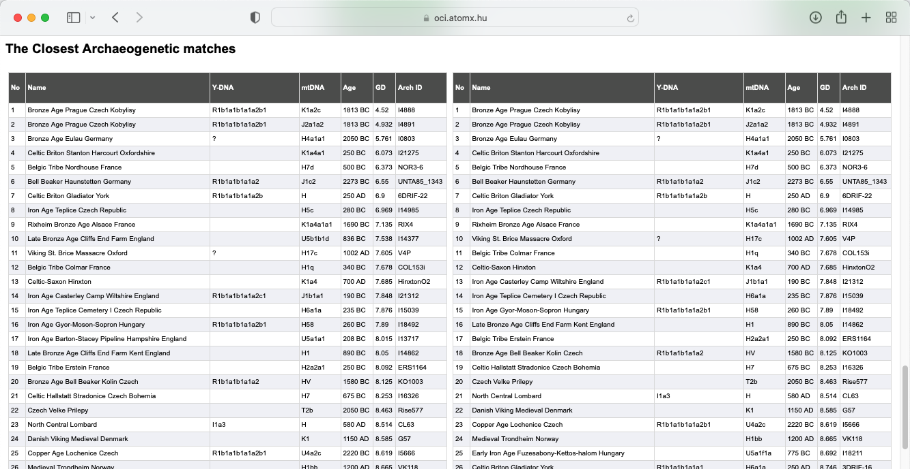
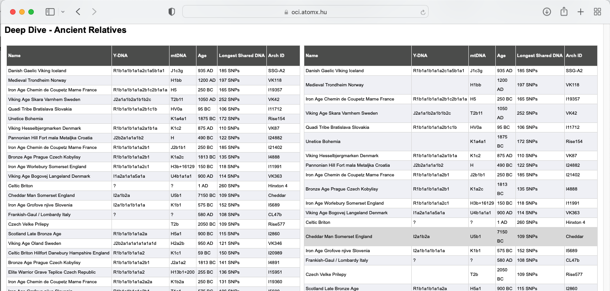

# MyTrueAncestry - Raw Data Extractor (mta-rde)

## Overview
This solution was developed for MyTrueAncestry.com users, to get raw data from the downloaded MyTrueAncestry.com html file. 

## Workflow

1. Login to MyTrueAncestry.com and download the website in html format
2. Open the https://oci.atomx.hu website in your browser
3. Open the downloaded file(s)
4. You'll get results immediately in your browser

## Functions
- get "**Ancient Samples Full Breakdown**", "**Deep Dive Full Breakdown**", "**Y-DNA Breakdown**" and "**mtDNA Breakdown**" data and display it as a table and chart
- display "**Closest Ancient Populations**", "**Closest Modern Populations**", "**The Closest Archaeogenetic matches**" and "**Deep Dive - Ancient Relatives**" as a table
- display two results side-by-side to support comparison

## Website
The website is available at https://oci.atomx.hu

## Sample Results
### Ancient Samples Full Breakdown

### Deep Dive Full Breakdown

### Closest Ancient abd Modern Populations

### Y-DNA Breakdown

### mtDNA Breakdown

### The Closest Archaeogenetic matches

### Deep Dive - Ancient Relatives

